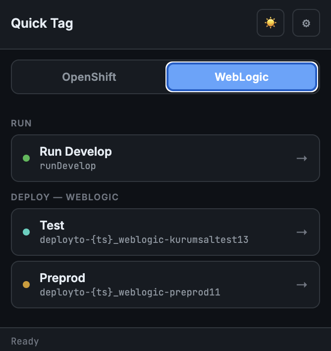
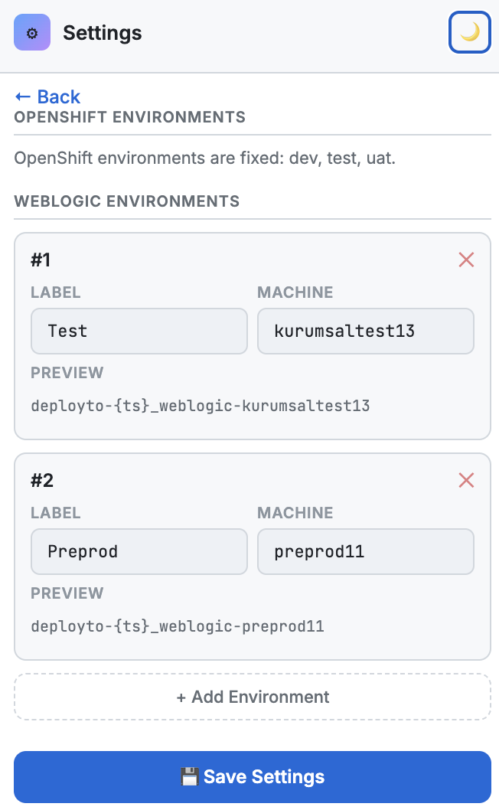

# Quick Tag

Chrome extension to quickly generate Bitbucket git tags for triggering OpenShift and WebLogic deployments.

## What it does

One-click tag creation with correct naming patterns:
- OpenShift: `deployto-{timestamp}_openshift-dev`, `deployto-{timestamp}_openshift-test`, `runUatDeploy-{timestamp}_openshift-uat`
- WebLogic: custom environments (fully editable)
- Auto timestamp in `YYYYMMDDTHHmm` format

## Screenshots

<table>
  <tr>
    <td></td>
    <td></td>
    <td></td>
  </tr>
</table>

## Installation (Developer mode)

1. Clone or download this repo
2. Go to `chrome://extensions/`
3. Enable **Developer mode** (top right)
4. Click **Load unpacked** and select this folder

The extension icon appears in your toolbar.

MIT License